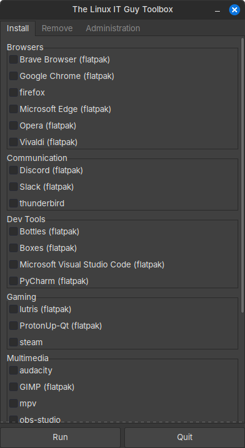

# The Linux IT Toolbox




**The Linux IT Toolbox** is a Python script that provides a user-friendly GUI for managing various applications and system settings on your Linux machine. Easily install or remove applications, manage power settings, or perform system updates with the click of a button! 🚀

## ✨ Features 

- **Install Applications**: Easily install a variety of applications categorized by their use.
- **Remove Applications**: Quickly remove unwanted applications.
- **Administration**: Manage power settings, update your system, and more.
- **Cross-Distribution Support**: Works on Arch-based, Debian-based, and Fedora-based distributions.
- **Automatic Dependency Installation**: Checks for and installs necessary dependencies.

## 🛠️ Install

- To get started, simply copy and paste this command in your terminal:
```
git clone https://github.com/TheLinuxITGuy/Toolbox.git && cd Toolbox && python3 Main.py
```

## 🖥️ Usage 

1. **Install Tab**: Select the applications you want to install from the categorized list and click "Run".
2. **Remove Tab**: Select the applications you want to remove and click "Run".
3. **Administration Tab**: Manage power settings, update your system, and more by selecting the desired options and clicking "Run".

## ⚙️ Configuration 

The applications and their categories are defined in the `apps_config.csv` file. You can customize this file to add or remove applications as needed.

